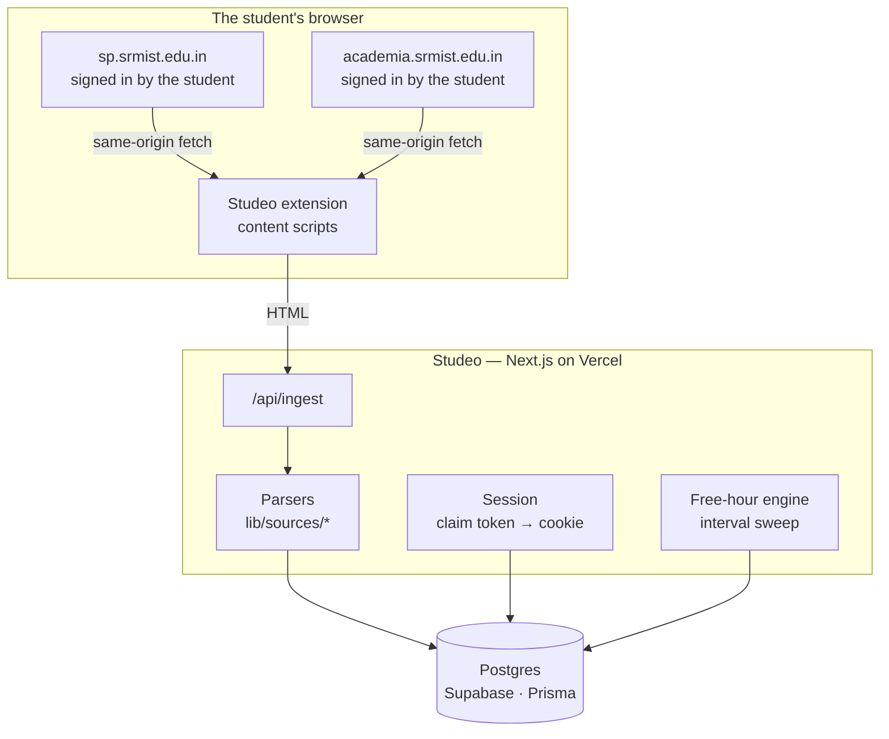

# Studeo

**A faster, calmer front-end for the SRM Academia portal — with one thing the official portal can't do: tell a group of friends when they're all free at the same time.**

_Latin `studeo` — "I study."_

> **Live preview:** _(deploy first, then link — it needs no credentials)_
> **Not affiliated with SRM Institute of Science and Technology.** Independent student project.

---

## The problem

SRM splits a student's data across two unrelated systems. Neither is fast, neither is designed for a phone, and getting the single number that actually matters — *how many classes can I still miss?* — takes several page loads and some mental arithmetic.

Studeo syncs that data once and answers the questions students actually have:

- **How many hours can I skip and stay above 75%?** Not "your attendance is 82.4%".
- **When is my whole friend group free today?** The portal knows five separate timetables. It will never intersect them for you.
- **What did that FT-I do to my internals?**

## Features

| | |
|---|---|
| **Attendance with margin** | Per course, in hours, plus the number that matters: how many you can still miss, or must now attend. |
| **Free-hour finder** | Intersects your timetable with your friends' — and surfaces near misses, since with five people there often is no perfect overlap. |
| **Timetable** | Day-order aware, one row per period, with gaps stated rather than left as whitespace. |
| **Internal marks** | Every component as it's entered, with course and overall totals. |
| **Preview** | The full product on sample data. No credentials, one click. |
| **Light and dark** | Light by default — deliberately, see below. |

## Architecture



### Four decisions worth explaining

**1. Studeo never logs in to SRM, and deliberately can't.**

The obvious design is a server-side scraper holding each student's credentials. SRM's Student Portal login blocks it outright: a CAPTCHA, device-fingerprint tokens (`fpPayload` / `fpToken`), per-session randomised field names, and a base64 host allowlist pinning the form to their own domain. Automating past that means defeating bot detection, so Studeo doesn't try.

Instead the **student logs in themselves**, in their own browser, CAPTCHA and all. A [browser extension](extension/) then fetches their own pages and posts the HTML here.

The security property this buys is stronger than any amount of encryption would have been: **there is no credential to steal.** No password, no session token, no vault. The server holds only the data a student can already read on the portal.

**2. The extension fetches in a content script, not the service worker.**

This is the detail that makes it work at all. `JSESSIONID` is `SameSite=Lax`, so a fetch issued from the extension's own origin counts as cross-site and the cookie is **not** attached — the request comes back as the login page with a `200`, and every parser downstream silently sees nothing. A content script's fetch is genuinely same-origin, so the browser attaches the session exactly as it would for a click.

**3. Two upstreams, because neither is complete.**

| Data | Source | Why |
|---|---|---|
| Attendance | Student Portal, form 9 | Academia's attendance page returns *"Page inaccessible — contact your administrator"* |
| Internal marks | Student Portal, form 13 | Academia renders marks on that same locked page |
| Academic calendar | Student Portal, form 129 | One row per date with an explicit day order — Academia publishes a six-months-across grid instead |
| Course slots | Academia | The Student Portal's timetable page returns `No Time Table Found..!` |

They are also completely different technologies. Academia is Zoho Creator, with page URLs carrying stale year suffixes (`My_Time_Table_2023_24` serving 2026-27 content). The Student Portal is a plain JSP app where navigation is a form post:

```
POST /srmiststudentportal/students/template/HRDSystem.jsp
     hdnFormId=9  &  csrfPreventionSalt=<token>
```

**4. Parsers are pure functions over captured HTML.**

[`lib/sources/fixtures/`](lib/sources/fixtures/) holds verbatim markup from the live portals, quirks and all. Tests assert against it — including that **our computed percentages equal the portal's own published figures**, and that the parsed course table reproduces a real Day 1 of eight teaching hours through the slot grid. When SRM changes their markup the suite fails, rather than the sync quietly writing zeroes into everyone's dashboard.

Tables are located by header text, never by index: the attendance page renders two structurally identical `table.mb-0` elements, and indexing would one day parse the monthly rollup as course data.

### The free-hour finder

Naively, you complement each student's timetable into their free set and intersect all N. The cleaner formulation: *a moment is commonly free iff nobody is busy then.* So take the union of every busy interval across the group and complement it once — one sort, one linear sweep.

Running that sweep with a **count** instead of a boolean costs nothing and produces the feature people actually want. In a group of five there is frequently no common gap at all, and *"everyone is free except Rahul"* is a far more useful answer than an empty list.

See [`lib/freehour.ts`](lib/freehour.ts) and its [tests](lib/freehour.test.ts) — the interesting cases are back-to-back classes (must not produce a zero-length gap) and one student's overlapping lab/theory slots (must count as one blocker, not two).

## Domain details that bite

**Attendance is measured in hours, not classes.** The portal's columns are `Max. hours / Att. hours / Absent hours`. A theory slot is one hour; a lab is two or three. Rendering hours as though they were classes tells a student with a 2-hour lab they have twice the slack they really do, so [`lib/attendance.ts`](lib/attendance.ts) computes strictly in hours and converts to sessions only where the caller knows that course's period length. Slack rounds down, debt rounds up.

**Day orders, not weekdays.** SRM schedules by Day 1–5, and a separate calendar maps each date to a day order. A holiday **pauses** the cycle rather than advancing it — verified against the published calendar, where 24 Aug is suspended and 25 Aug is still Day 5. Model it any other way and every timetable is silently offset after the first festival.

**Periods aren't clock hours.** They run 08:00, 08:50, 09:45, 10:40 — 50 minutes with staggered breaks — so a clock-hour axis puts "10" a full 40 minutes from where the 10:40 class starts. The portal also prints afternoon times without a meridiem (`01:25 - 02:15`), which parsed literally puts half the teaching day after midnight.

**"Today" means today in Chennai.** Using the server's UTC date is wrong for five and a half hours out of every twenty-four — precisely the evening, when a student is checking what they have in the morning.

## Design

Monochrome, paper-light. **There is no accent hue at all**: buttons and links are ink, which means the only colour anywhere on screen is attendance status. Green, amber and red mean comfortable, on the line, and below 75% — and they mean nothing else, ever. A student glancing at the page never has to work out whether a red thing is a warning or a button.

Light is the default and `prefers-color-scheme` is deliberately ignored. Most developers and a good share of students run their OS dark; honouring it would mean almost nobody ever saw the design. Dark is properly built and one click away.

Every colour lives in one block of tokens in [`app/globals.css`](app/globals.css) — no component contains a hex value. [`/palettes`](app/palettes/page.tsx) renders the real dashboard under six alternative schemes.

## Local setup

```bash
git clone https://github.com/<you>/studeo.git
cd studeo
npm install
cp .env.example .env.local
```

Generate the two secrets:

```bash
node -e "console.log(require('crypto').randomBytes(32).toString('base64'))"
```

Point `DATABASE_URL` and `DIRECT_URL` at Postgres ([Neon](https://neon.tech) or [Supabase](https://supabase.com); use the pooled string for the first and the session-pooler string for the second), then:

```bash
npx prisma migrate dev
npm run db:seed
npm run dev
```

The seed populates five sample students, so the app is fully explorable at `/preview` without ever touching a real SRM login.

<details>
<summary>If <code>next build</code> dies with <code>0xc0000409</code> or a PostCSS subprocess crash</summary>

Turbopack forks a Node subprocess for PostCSS, and on a memory-constrained machine it gets killed rather than reporting a useful error:

```bash
NODE_OPTIONS=--max-old-space-size=4096 npm run build
```

Not needed on Vercel.
</details>

## The extension

```
chrome://extensions → Developer mode → Load unpacked → select extension/
```

Then sign in to the Student Portal (and Academia, if you want a timetable), open the extension and press **Sync now**. Set the Studeo address in the popup's settings if you aren't running on `localhost:3000`.

## Tests

```bash
npm test
```

118 tests. The parsers run against real captured HTML; the domain logic runs against real published figures.

## Deployment

Vercel, with Postgres on Supabase.

- **Pin the function region to Mumbai.** [`vercel.json`](vercel.json) sets `bom1` to match the database. Functions in Washington talking to a database in Mumbai pay a 200 ms round trip on *every query*, and a dashboard makes several.
- Set every variable from `.env.example` in the project settings, with `NEXT_PUBLIC_APP_URL` as the real deployed origin — the extension builds its claim URL from it.
- A daily [keepalive cron](app/api/cron/keepalive/route.ts) stops a free Supabase project pausing itself after a week of inactivity. A paused project doesn't wake on its own, and the failure mode is a dead site on a link you sent weeks ago.

## Known limitations

- **The extension is not yet exercised against the live portal.** Its fetch shapes are written from observed requests, not from a round trip.
- **Identity is weak.** Possession of a freshly-fetched profile page is the credential. Friendships require acceptance, so impersonation grants access to nobody else's data — but it would let someone squat on an account. Verifying the `@srmist.edu.in` address by email is the fix.
- **Marks components need a second request per course**, which the extension doesn't yet make; until then a course shows its total only.

## Prior art

[Campus Web](https://campusweb.in) and [PortalX](https://srmportalx.vercel.app) solve overlapping problems for the same campus. Both take the server-side-scraper approach this project deliberately doesn't.

`reddy-api-srm` was audited as a candidate for the Academia HTTP layer — MIT, no install scripts, no `eval`/`child_process`/filesystem access, every request to `academia.srmist.edu.in` and nowhere else. It became unnecessary once fetching moved into the browser, and was removed rather than left as an unused dependency.

## Disclaimer

Studeo is an independent project with no affiliation to, endorsement from, or connection with SRM Institute of Science and Technology. It reads only data the signed-in student can already see on the official portals, on their own behalf, in their own browser.

## Licence

MIT
