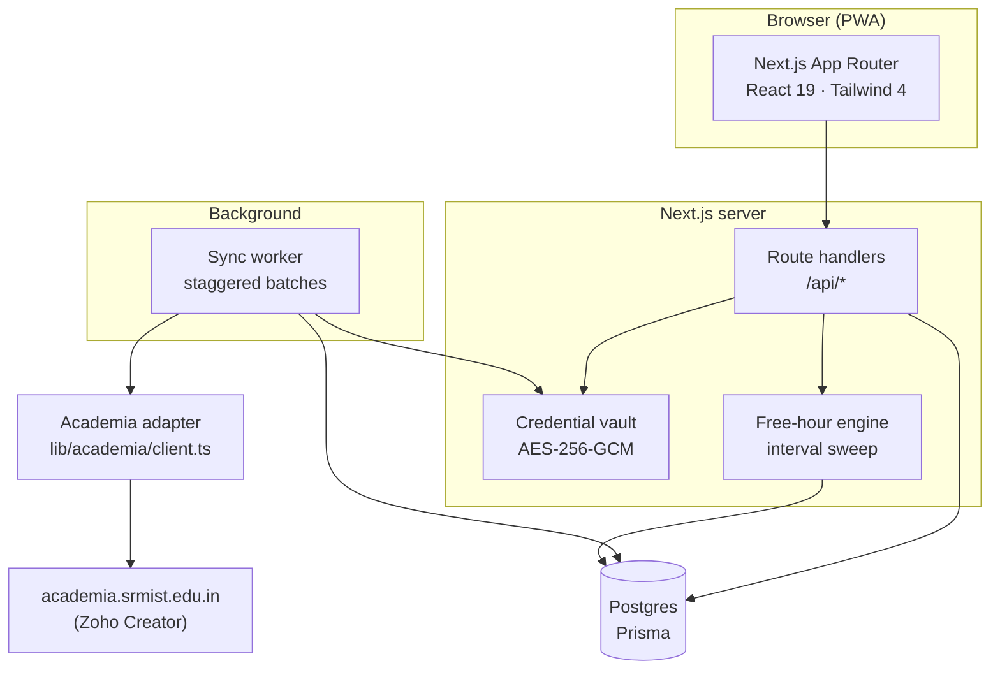

# Studeo

**A faster, calmer front-end for the SRM Academia portal — with one thing the official portal can't do: tell a group of friends when they're all free at the same time.**

_Latin `studeo` — "I study."_

> **Live demo:** _(deploy first, then link — the demo needs no credentials)_
> **Not affiliated with SRM Institute of Science and Technology.** Independent student project.

---

## The problem

SRM's Academia portal is a Zoho Creator app. It is slow, it is not designed for a phone, and getting a single number out of it — "how many classes can I still miss?" — takes several page loads and some mental arithmetic.

Studeo syncs your academic data once and answers the questions you actually have:

- **How many classes can I skip and stay above 75%?** Not "your attendance is 82.4%".
- **When is my whole friend group free today?** The portal knows five separate timetables. It will never intersect them for you.
- **What did that CLA-2 do to my internals?**

## Features

| | |
|---|---|
| **Attendance with margin** | Per-course percentage, plus the number that matters: classes you can still miss, or must now attend. |
| **Free-hour finder** | Intersects your timetable with your friends' to find genuinely common gaps — and near misses, since with five people there often is no perfect overlap. |
| **Marks** | Every assessment, with running internal totals. |
| **Timetable** | Day-order aware, so it stays correct after holidays shift the schedule. |
| **Offline-first** | Cached locally; opens instantly, revalidates in the background. |
| **Demo mode** | The full product on seeded data. No credentials, one click. |

## Architecture



### Three decisions worth explaining

**1. We store session cookies, not passwords.**

The obvious design is to encrypt each user's SRM password so a cron job can re-login and scrape on a schedule. That design is worse than it looks: the worker has to *decrypt on a schedule*, so the key is always in reach of the same process that holds the ciphertext. Encryption-at-rest buys you very little against the realistic threat.

Instead, the password exists for exactly one function call — [`signIn()`](lib/academia/client.ts) — and is never written anywhere. What gets sealed into the vault is the **Zoho session cookie** it returns. Every subsequent fetch uses only that cookie.

The security property this buys: if the database leaks, an attacker gets short-lived session tokens for a student portal. Not a set of reusable college passwords, which students very often share with their email.

The cost is honest — sessions expire, so users re-authenticate periodically. That's a trade we're happy to make and it's visible in the UI as a normal "sign in again" state rather than a silent failure.

**2. The free-hour finder is a sweep, not an N-way set intersection.**

Naively, you complement each student's timetable into their free set and intersect all N. The cleaner formulation: *a moment is commonly free iff nobody is busy then*. So take the union of every busy interval across the group and complement it once — one sort, one linear pass.

Running that sweep with a **count** instead of a boolean costs nothing and produces the feature people actually want. In a group of five there is frequently no common gap at all, and "everyone is free except Rahul" is a far more useful answer than an empty list.

See [`lib/freehour.ts`](lib/freehour.ts) and its [tests](lib/freehour.test.ts) — the interesting cases are back-to-back classes (must not produce a zero-length gap) and one student's overlapping lab/theory slots (must count as one blocker, not two).

**3. Two upstreams, composed behind one port.**

SRM splits a student's data across two unrelated systems, and neither is complete on its own:

| Data | Source | Why |
|---|---|---|
| Attendance | **Student Portal** form 9 | Academia's attendance page returns *"Page inaccessible — contact your administrator"* |
| Internal marks | **Student Portal** form 13 | Academia renders marks on that same locked page |
| Academic calendar | **Student Portal** form 129 | One row per date with an explicit day order — Academia publishes a six-months-across grid instead |
| Timetable & slots | **Academia** | The Student Portal's timetable page returns `No Time Table Found..!` |

They are also completely different technologies. Academia is Zoho Creator: an iframed sign-in, client-side password encryption, and page URLs that carry stale year suffixes (`My_Time_Table_2023_24` serving 2026-27 content), which is why its client library ships a `resetUrlCache()`. The Student Portal is a plain JSP app where navigation is a form post:

```
POST /srmiststudentportal/students/template/HRDSystem.jsp
     hdnFormId=9  &  csrfPreventionSalt=<token>
```

Academia's HTTP work uses [`reddy-api-srm`](https://github.com/iamgowthamsree/reddy-api-srm), audited before adoption: MIT, no install scripts, no `eval` / `child_process` / filesystem access, and every outbound request goes to `academia.srmist.edu.in` and nowhere else. The Student Portal is parsed by [`lib/sources/student-portal.ts`](lib/sources/student-portal.ts).

Both sit behind one port, so nothing above `lib/sources/` knows there are two systems — or which one went down.

**Parsers are pure functions over captured HTML.** [`lib/sources/fixtures/`](lib/sources/fixtures/) holds verbatim markup from the live portal, quirks and all, and the [tests](lib/sources/student-portal.test.ts) assert against it — including that our computed percentages match the portal's own published figures. When SRM changes their markup the test suite fails, rather than the nightly sync quietly writing zeroes into everyone's dashboard.

Tables are located by header text, never by index: the attendance page renders two structurally identical `table.mb-0` elements, and indexing would one day parse the monthly rollup as course data.

### Being a good citizen of someone else's portal

Academia allows **two concurrent sessions per student**. A sync worker that re-logs-in aggressively will silently kick students out of their own portal, so we pass `maxRetries: 0` and refuse to terminate anyone's sessions — we fail and tell the user instead.

Syncs are **staggered**, not parallel (`SYNC_STAGGER_MS`), and batched (`SYNC_BATCH_SIZE`). One fetch per user per sync window, never one per page view. Academia can also demand a captcha; that surfaces as "sign in again", and we make no attempt to defeat it.

## Data model

Two details drive the schema ([`prisma/schema.prisma`](prisma/schema.prisma)):

**Day orders, not weekdays.** Academia schedules by Day 1–5, and a separate campus calendar maps each date to a day order. Holidays don't blank a day — they push the order forward. So "what do I have on Tuesday" is only answerable as date → day order → timetable, and modelling it any other way produces a timetable that silently goes wrong after every holiday.

**Times as integers.** Slots store `startMin`/`endMin` as minutes from midnight rather than timestamps. The interval arithmetic is exact, timezone-free, and trivially testable.

## Local setup

```bash
git clone https://github.com/<you>/studeo.git
cd studeo
npm install
```

```bash
cp .env.example .env.local
```

Generate the two secrets:

```bash
node -e "console.log(require('crypto').randomBytes(32).toString('base64'))"
```

Point `DATABASE_URL` at a Postgres instance ([Neon](https://neon.tech) and [Supabase](https://supabase.com) both have a sufficient free tier), then:

```bash
npx prisma migrate dev
npx prisma db seed
npm run dev
```

The seed populates the demo accounts, so the app is fully explorable without ever touching a real SRM login.

<details>
<summary>If <code>next build</code> dies with <code>0xc0000409</code> or a PostCSS subprocess crash</summary>

Turbopack forks a Node subprocess for PostCSS, and on a memory-constrained machine it gets killed rather than reporting a useful error. Give it more headroom:

```bash
NODE_OPTIONS=--max-old-space-size=4096 npm run build
```

Not needed on Vercel, which has plenty.
</details>

## Tests

```bash
npm test
```

## Deployment

Vercel, with Postgres on Neon or Supabase. Set every variable from `.env.example` in the project settings — note that `VAULT_KEY` rotation invalidates all stored sessions and forces users to sign in again, which is a survivable outcome rather than data loss. That's rather the point of storing sessions instead of passwords.

## Acknowledgements

- [`reddy-api-srm`](https://github.com/iamgowthamsree/reddy-api-srm) by Gowtham — the Academia HTTP layer.

## Disclaimer

Studeo is an independent project with no affiliation to, endorsement from, or connection with SRM Institute of Science and Technology. It reads only data the signed-in student can already see on the official portal, on their behalf.

## Licence

MIT
